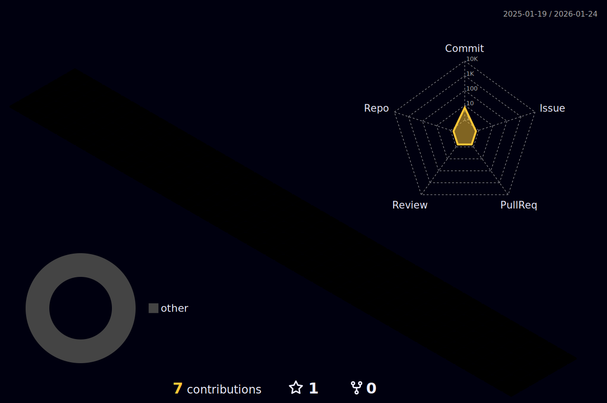

 
  

  

   

  &nbsp;
  &nbsp;
  &nbsp;
  

 

---

### 👨‍💻 **About Me**

> *"Code like a Developer, Lead like a Captain."*

I am a **High-Performance Full Stack Developer** who thrives on solving complex problems. My journey involves architecting the winning solution for the **Smart India Hackathon (SIH)** and leading sports teams at the **National Level**.

* 🔭 **Focus:** MERN Stack & AI Integration.
* 🏆 **Win:** Led "Phantom Techies" to win **₹1.5 Lakhs** at SIH 2025.
* 🏐 **Sports:** West Zone Inter-University Volleyball Player.

---

### 🚀 **Tech Stack**

  

---

### 📊 **GitHub Analytics**

  <table border="0">
    <tr>
      <td></td>
      <td></td>
    </tr>
  </table>
  
  

---

### 🏙️ **3D Contribution City**

  

---

### 🐍 **Snake Animation**

  

---

  

